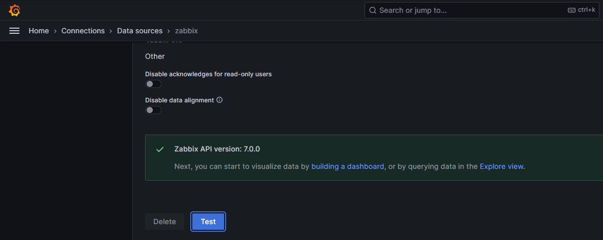

//Docker Compose - Zabbix NGINX PostgreSQL + Grafana

- [Dockerfiles Oficiais do Zabbix](https://github.com/zabbix/zabbix-docker)
- [Plugin do Zabbix para painéis do Grafana](https://github.com/grafana/grafana-zabbix)


Para aqueles que estão acostumados a usar o Zabbix para coletar métricas, mas querem começar a desenhar painéis mais bonitos.

Exemplo de serviço docker-compose simples:

- **PostgreSQL:**                16.2
- **Zabbix Server:**             7.0.3
- **Zabbix Frontend NGINX:**     7.0.3
- **Zabbix Agent:**              7.0.3
- **Grafana:**                   11.2.0

//Guia

//Clone o repositório:
```
git clone https://github.com/akmalovaa/zabbix-docker.git
cd zabbix-docker
```

//Verifique ou altere as configurações no arquivo `.env`

//Execute o docker-compose:
```
docker-compose up -d
```

A primeira inicialização leva de 1 a 2 minutos.

//Zabbix `localhost:8080`
Senha de usuário padrão 
- **login:** Admin
- **senha:** zabbix


**Zabbix server** - Host / altere o uso da conexão do DNS `zabbix-agent`


//Grafana `localhost:3000` 

Senha de usuário padrão (altere `grafana/grafana.ini` auth.anonymous enabled)
- **login:** admin
- **senha:** 12345

Teste a fonte de dados

`Grafana -> Conexões -> Fontes de dados -> zabbix -> Testar`


//Depuração
```
docker-compose logs --tail=1 -f
```
